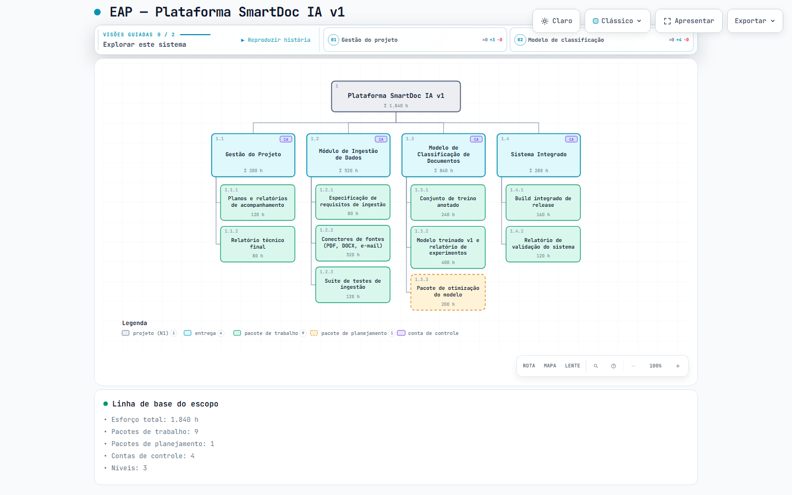
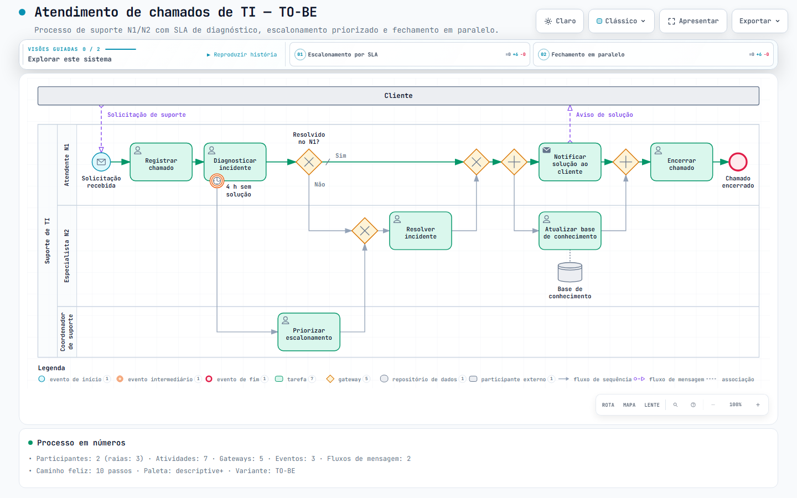
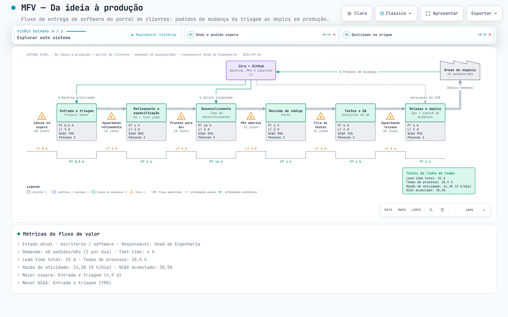
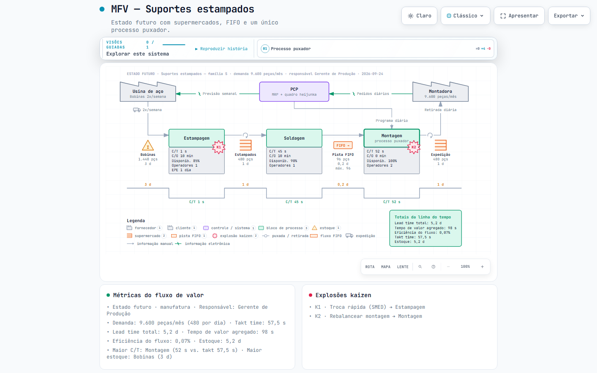
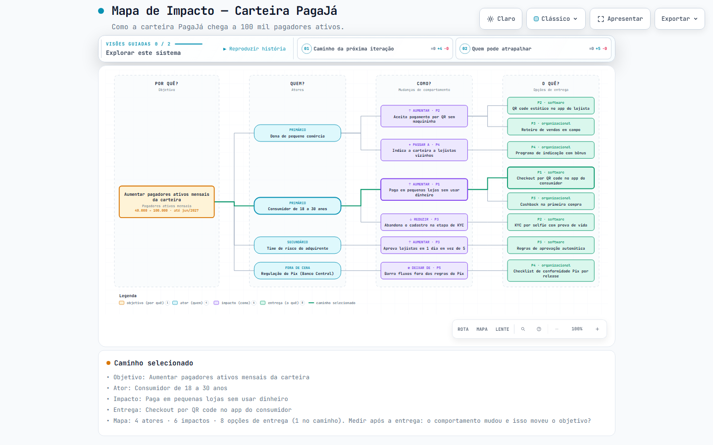
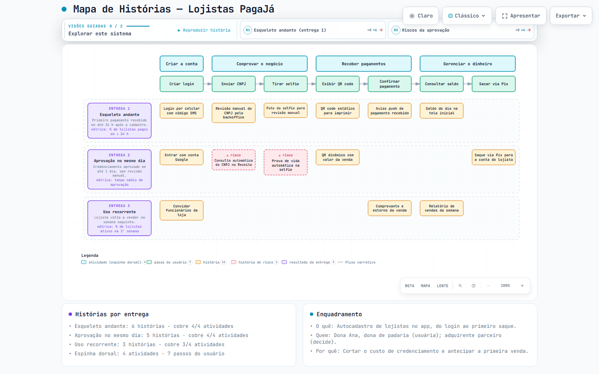
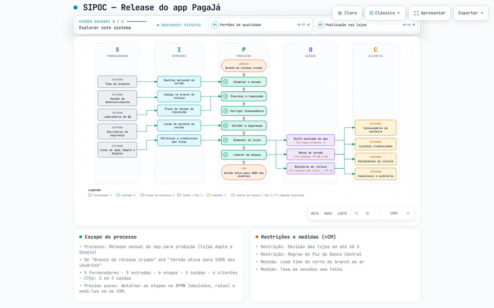

<div align="center">

# Bizify

**Business diagrams for technology projects — validated by method, explorable as HTML.**

WBS / EAP · BPMN 2.0 · Value Stream Maps · Impact Maps · User Story Maps · SIPOC

[](https://github.com/daniellins/bizify/actions/workflows/ci.yml)
[](LICENSE)


[](https://github.com/tt-a1i/archify)

[Português](README.pt-BR.md) · [Documentation](docs/) · [Contributing](CONTRIBUTING.md) · [Changelog](CHANGELOG.md)

</div>

---

Bizify is an **Agent Skill** (Claude Code and compatible agents) that turns a business question
into a typed JSON spec, derives the layout, **computes the numbers**, enforces the rules of the
underlying method and delivers one self-contained, interactive HTML file — with dark/light themes,
visual presets, pan/zoom, search, focus, guided views, presentation mode and PNG/SVG/WebM export.

> **Bizify is a fork of [Archify](https://github.com/tt-a1i/archify) by [tt-a1i](https://github.com/tt-a1i).**
> Archify is an excellent skill for *software architecture* diagrams. Bizify keeps Archify's viewer,
> delivery pipeline and quality gates, and replaces the architecture knowledge with **business
> diagrams** that technology projects need — scope, process, flow and planning. If you need
> architecture, sequence, data-flow or state diagrams, use Archify. See [Origin and credits](#origin-and-credits).

## Gallery

| WBS / EAP | BPMN 2.0 |
|---|---|
|  |  |
| **Value Stream Map (office / software)** | **Value Stream Map (manufacturing)** |
|  |  |
| **Impact Map** | **User Story Map** |
|  |  |
| **SIPOC** | |
|  | |

Every image above is a screenshot of a generated HTML file from [`bizify/examples/`](bizify/examples/).

## Why Bizify

Drawing a business diagram is easy; drawing one that survives a PMO, a client or an R&D reviewer
is not. Bizify encodes the method, so a diagram that passes is also **methodologically defensible**:

- **The method is the product.** ~100 rules researched from the primary sources (PMI, NASA, GAO,
  MIL-STD-881F, OMG BPMN 2.0.2, Rother & Shook, Martin & Osterling, Adzic, Patton, ASQ), each with
  an id such as `R-WBS-08`, a level and a citation in [`bizify/references/`](bizify/references/).
- **HARD rules refuse the spec** (two WBS roots, children that don't sum to their parent, a sequence
  flow crossing pools, a VSM total that disagrees with the computed one).
- **SOFT rules become advisories** (verb-named WBS elements, unlabelled gateway branches, a release
  slice without an outcome). In the `showcase` profile they block delivery until fixed or **waived
  with an explicit reason** — waivers stay visible in the receipt.
- **Numbers are computed, never trusted.** WBS roll-ups (Σ), VSM lead time, process time, activity
  ratio, rolled %C&A, takt and inventory days are calculated and cross-checked against any authored total.
- **Semantics, not coordinates.** Authors describe parents, lanes, order, kinds and metrics; the
  renderer places everything with orthogonal routes, masked labels and first-screen proportions.
- **Bilingual viewer.** English by default; `meta.locale: "pt-BR"` localizes controls, legends,
  summary cards and number formatting (the fork added Brazilian Portuguese).

## Diagram types

| Type | Question it answers | Sources |
|---|---|---|
| `wbs` | What does the project deliver, and does it cover 100% of the scope? | PMI Practice Standard for WBS, PMBOK, NASA WBS Handbook, GAO-20-195G, MIL-STD-881F |
| `bpmn` | Who does what, in which order, with which decisions and hand-offs? | OMG BPMN 2.0.2 (ISO/IEC 19510), Silver *Method & Style*, Camunda |
| `vsm` | Where does work wait, and how much of the lead time adds value? | Rother & Shook *Learning to See*, Martin & Osterling, DevOps Handbook |
| `impactmap` | Which deliverables move the business goal, through whose behaviour? | Adzic *Impact Mapping* |
| `storymap` | What is the smallest end-to-end release that delivers the outcome? | Patton *User Story Mapping* |
| `sipoc` | Where does the process start and end, who feeds and who receives it? | ASQ, Lean Six Sigma |

The methods chain naturally: impact map (why) → story map (what first) → WBS (scope baseline);
SIPOC (scope a process) → BPMN (logic) → VSM (time and waste).

## Installation

Requirements: **Node.js 18+**. No runtime dependencies; a Chromium-based browser is optional (used
only by `visual-check` for screenshots and containment evidence).

**With the skills CLI** (Claude Code, global):

```bash
npx -y skills add daniellins/bizify --skill bizify --agent claude-code --global --copy --yes
```

**Manually:** copy the [`bizify/`](bizify/) folder to `~/.claude/skills/bizify` (user level) or
`.claude/skills/bizify` (project level), then check it:

```bash
node ~/.claude/skills/bizify/bin/bizify.mjs doctor    # → "Bizify is ready."
```

## Quick start

Ask your agent in plain language — the skill triggers on the business question:

```text
"Build the WBS for project VisionQC with the hours per work package"
"Model our purchase-approval process in BPMN, AS-IS, with the supplier as an external pool"
"Map the current value stream of our incident handling; we work 8 h per day"
"Monte o mapa de impacto: queremos 30% mais lojistas ativos até março"
```

Or drive the CLI directly:

```bash
cd ~/.claude/skills/bizify
node bin/bizify.mjs guide "where does our delivery wait?"          # recommends a type + prompt
node bin/bizify.mjs validate wbs examples/rd-project.wbs.json --quality showcase --json
node bin/bizify.mjs deliver  wbs examples/rd-project.wbs.json out/wbs.html --quality showcase
node bin/bizify.mjs visual-check out/wbs.html --json                # browser evidence + PNGs
```

A minimal WBS spec:

```json
{
  "schema_version": 1,
  "diagram_type": "wbs",
  "meta": { "title": "WBS — Customer Portal", "quality_profile": "showcase" },
  "elements": [
    { "id": "root", "label": "Customer Portal v1" },
    { "id": "pm", "parent": "root", "label": "Project Management", "common": "project-management" },
    { "id": "pm-plan", "parent": "pm", "label": "Project plan and status reports", "effort": 80 },
    { "id": "pm-close", "parent": "pm", "label": "Closure report", "effort": 24 },
    { "id": "app", "parent": "root", "label": "Web Application" },
    { "id": "app-auth", "parent": "app", "label": "Authentication module", "effort": 120 },
    { "id": "app-panel", "parent": "app", "label": "Customer dashboard", "effort": 200 }
  ]
}
```

## How it works

```
business question ─▶ typed JSON spec ─▶ schema (AJV, strict) ─▶ method rules (HARD / SOFT)
        ─▶ layout from structure ─▶ inline SVG with semantic attributes ─▶ Archify viewer (HTML)
        ─▶ artifact checks (9) ─▶ deliver (atomic, SHA-256 receipt) ─▶ visual-check (browser)
```

Details: [docs/architecture.md](docs/architecture.md) · [docs/methodology.md](docs/methodology.md) ·
[docs/adding-a-diagram-type.md](docs/adding-a-diagram-type.md).

## Repository layout

```
bizify/                  the skill (what gets installed)
  SKILL.md               agent instructions and type router
  bin/                   CLI: validate, deliver, visual-check, guide, doctor, demo
  renderers/<type>/      one renderer per diagram type + shared engine
  schemas/               JSON Schemas (2020-12) per type
  references/            theory-*.md (methods, rules, sources) and authoring-*.md guides
  examples/              one validated example per type
  assets/template.html   the viewer inherited from Archify
  test/                  node:test suite
docs/                    project documentation and gallery images
```

## Contributing

Contributions are very welcome — new diagram types (Kanban board, RACI matrix, Gantt, OKR tree,
Business Model Canvas, C4-for-business…), better layouts, rule corrections backed by sources,
translations and examples. Start with [CONTRIBUTING.md](CONTRIBUTING.md) and the
[roadmap](ROADMAP.md). Please follow the [Code of Conduct](CODE_OF_CONDUCT.md).

## Origin and credits

Bizify exists because **[Archify](https://github.com/tt-a1i/archify)** exists. Archify, created by
**[tt-a1i](https://github.com/tt-a1i)** (itself based on
[Cocoon-AI/architecture-diagram-generator](https://github.com/Cocoon-AI/architecture-diagram-generator)),
built the hard parts: the standalone viewer, the deterministic delivery pipeline, the geometry and
composition checks, the export system and the brand-mark catalogue. Bizify forked
**Archify 2.17.0-dev.1** in September 2026 and:

- removed the architecture, workflow, sequence, data-flow and lifecycle renderers;
- added six business renderers, schemas and ~100 method rules with researched sources;
- added methodology advisories, waivers and computed metrics to the quality gate;
- added a Brazilian Portuguese viewer locale.

Thank you, tt-a1i, for building Archify and releasing it under the MIT license. Improvements to the
shared engine that are not business-specific are good candidates to offer upstream to Archify.
Full attribution: [NOTICE.md](NOTICE.md) and [bizify/THIRD_PARTY_NOTICES.md](bizify/THIRD_PARTY_NOTICES.md).

## License

[MIT](LICENSE) © 2026 Daniel Lins, with the original Archify and Cocoon AI copyright notices preserved.
